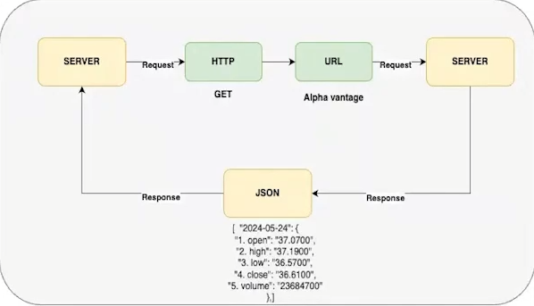

# Estudos de Backend

Repositório de anotações e materiais de estudo da Fase 2 da Pós Tech de Full Stack Development na FIAP.

O conteúdo acompanha a evolução dos fundamentos de backend: primeiro ambientes e contêineres, depois APIs e, nas próximas etapas, Node.js, bancos de dados, automação e observabilidade.

## Conteúdo do repositório

### Docker e contêineres

- [Aula 01 - Introdução ao Docker](introducao-docker/aula-01-introducao-ao-docker.md): conceitos de contêineres, WSL, Docker Desktop e primeiros comandos.
- [Aula 02 - Introdução ao Docker](introducao-docker/aula-02-introducao-ao-docker.md): continuação dos fundamentos e práticas com Docker.
- [Aula 01 - Gerenciamento de contêineres](gerenciamento-de-containeres/aula-01-gerenciamento-de-containeres.md): imagens, Dockerfile, redes, volumes, logs e comandos de gerenciamento.
- [Aula 02 - Gerenciamento de contêineres](gerenciamento-de-containeres/aula-02-gerenciamento-de-containeres.md): aprofundamento do gerenciamento e da operação de contêineres.

### Introdução a APIs

- [Aula 01 - O que é uma API](introducao-api/aula-01-api): APIs, endpoints e comunicação entre sistemas.
- [Aula 02 - REST na prática com Node.js](introducao-api/aula-02-rest-com-node): recursos, URLs, métodos HTTP e princípios RESTful.
- [Aula 03 - gRPC com Node.js](introducao-api/aula-03-grpc-com-node): comunicação entre serviços usando gRPC.
- [Aula 04 - GraphQL com Node.js](introducao-api/aula-04-graphql-com-node): APIs GraphQL e consulta de dados.

## Ordem sugerida de estudo

1. Entender o problema que o Docker resolve e preparar o ambiente com WSL e Docker Desktop.
2. Praticar a criação, execução e administração de contêineres.
3. Compreender o papel das APIs e o conceito de endpoint.
4. Implementar APIs usando REST, gRPC e GraphQL com Node.js.
5. Avançar para estrutura de projetos Node.js, Express, rotas e arquitetura MVC.
6. Estudar persistência, bancos de dados, CI/CD, documentação e observabilidade.

## Pré-requisitos

Para acompanhar as aulas práticas, é útil ter:

- conhecimentos básicos de terminal e Git;
- Docker Desktop instalado e integrado ao WSL no Windows;
- Node.js e npm instalados para os exemplos de API;
- familiaridade inicial com HTTP, JSON e JavaScript.

## Roadmap de backend

### Docker

- Papel dos contêineres no desenvolvimento de aplicações modernas.
- Ambientes padronizados, portáveis e fáceis de executar.
- Gerenciamento de contêineres, conceitos iniciais de orquestração e solução de problemas.

### Desenvolvimento de APIs

- REST na prática usando Node.js.
- Criação de endpoints e organização das requisições.
- gRPC e GraphQL com Node.js.

### Node.js e integração com bancos

- Estrutura de projetos Node.js, Express, rotas e arquitetura MVC.
- Integração com PostgreSQL e MongoDB.
- CI/CD com GitHub Actions.
- Documentação com Swagger e Redoc.
- Logs, métricas e observabilidade com Prometheus e Grafana.

### Bancos de dados

- Armazenamento, modelagem, índices e performance.
- Bancos relacionais, documentais e colunares.
- Conceitos de cloud e DBaaS.

## Objetivo

Consolidar fundamentos e boas práticas de backend, com foco em arquitetura de aplicações, desenvolvimento de APIs, integração com bancos de dados, contêineres, automação e observabilidade.
